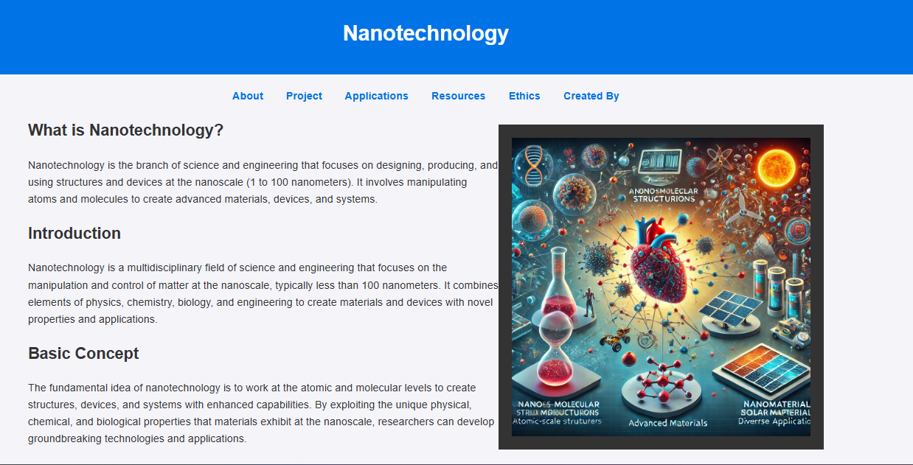
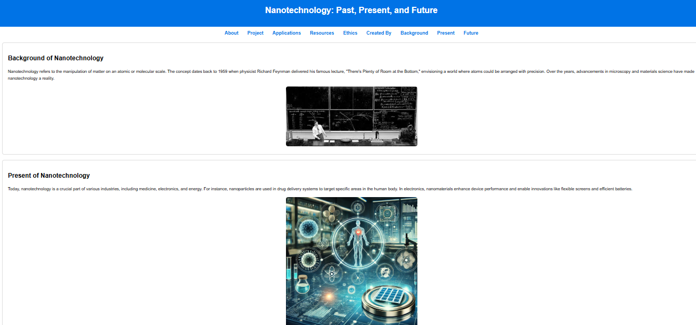
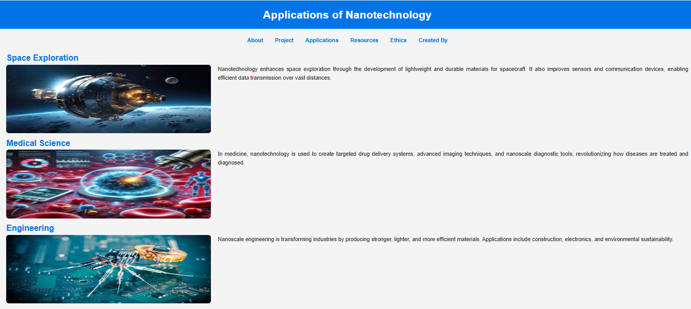
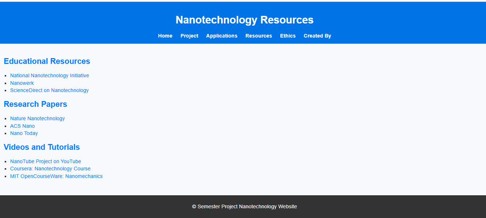
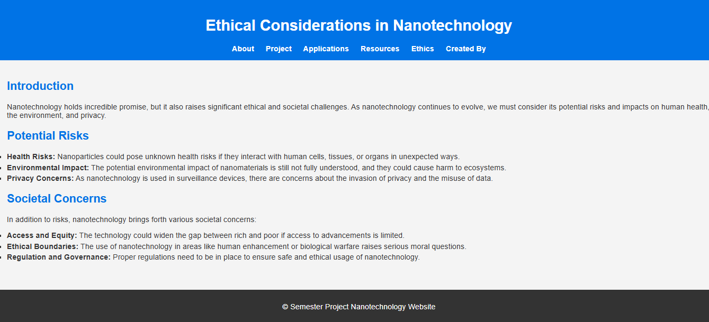

# Nanotechnology Information Website 🌐

## 📌 Overview
The Nanotechnology Information Website is a simple educational web project designed to explain fundamental concepts of nanotechnology in a structured and user-friendly way.  

The website presents information through clearly organized sections, helping users understand applications, ethical considerations, and resources related to nanotechnology.

---

## ✨ Features

- Informational content on nanotechnology fundamentals  
- Clean and structured layout for easy understanding  
- Responsive design for different screen sizes  
- Basic JavaScript interactions for improved user experience  
- Multiple categorized sections for better navigation  

---

## 🛠️ Tech Stack

- HTML  
- CSS  
- JavaScript  

---

## 📸 Screenshots

### 📄 About Section

### 🧪 Project Overview

### 🚀 Applications

### 📚 Resources

### ⚖️ Ethics

---

## 🚀 How to Run

1. Clone this repository  
2. Open `index.html` in any web browser  

---

## 📌 Purpose
This project was developed to strengthen understanding of frontend web development concepts and to present technical information in a simple and accessible format.

It also demonstrates the ability to structure educational content, design user-friendly interfaces, and implement basic interactivity using JavaScript.

---

## ⚠️ Limitations

- Static content (no backend or database)  
- Limited interactivity  
- No dynamic data fetching  

---

## 🔮 Future Improvements

- Add interactive animations or visual explanations  
- Integrate external APIs for dynamic content  
- Improve UI/UX design and accessibility  
- Add search functionality within content  

---
